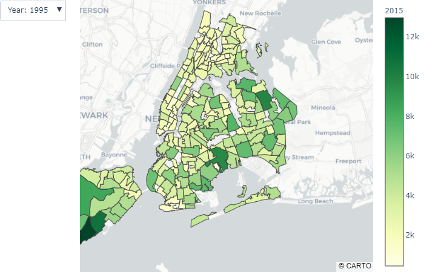
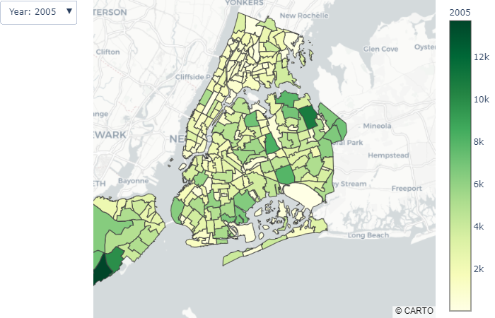
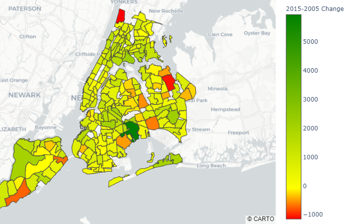
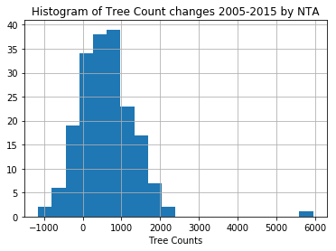
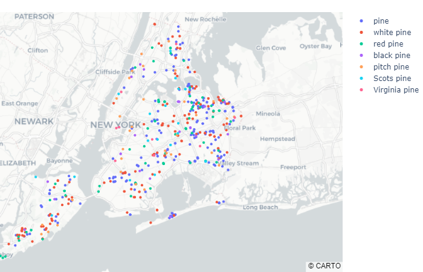
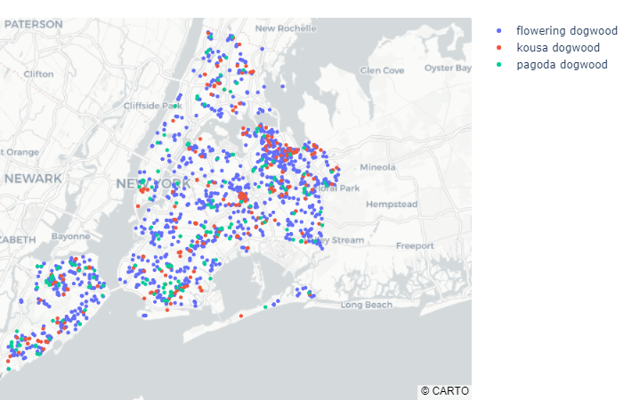

# New York Tree Census (1995, 2005, 2015)

Interactive map of New York Tree Census (2015) available here: 
http://nyc-tree-mapper.herokuapp.com/

## Dataset and Description courtesy of Kaggle.com

https://www.kaggle.com/nycparks/tree-census

### Context
>New York City’s trees shade us in the summer, beautify our neighborhoods, help reduce noise, and support urban wildlife. Beyond these priceless benefits, our urban forest provides us a concrete return on the financial investment we put into it. This return includes stormwater interception, energy conservation, air pollutant removal, and carbon dioxide storage. Our publicly owned trees are as much of an asset to us as our streets, sewers, bridges, and public buildings.

### Content
This dataset includes a record for every tree in New York City and includes the tree's location by borough and latitude/longitude, species by Latin name and common names, size, health, and issues with the tree's roots, trunk, and branches.

### Acknowledgements
The 2015, 2005, and 1995 tree censuses were conducted by NYC Parks and Recreation staff, TreesCount! program staff, and hundreds of volunteers.

## NTA Map obtained from NYC Open Data

https://data.cityofnewyork.us/City-Government/NTA-map/d3qk-pfyz

### NTA map
Boundaries of Neighborhood Tabulation Areas as created by the NYC Department of City Planning using whole census tracts from the 2010 Census as building blocks. These aggregations of census tracts are subsets of New York City's 55 Public Use Microdata Areas (PUMAs).

The geojson file obtained is edited to copy the NTA code from *features.properties.ntacode* to *features.id*. 
This was done to accommodate the plotly choropleth which must the json in this format to read.

## Tree Mapping

Choropleth of tree numbers per NTA in 1995, 2005, 2015. Places like Central Park and Prospect Park are **NOT** included in the tree census. The tree-lined suburbia of Staten Island wins every year at having the most trees. 

(Plotly map in notebook is interactive and selectable)

Choropleth of change in tree numbers per NTA from 2005 to 2015.  

Brooklyn NTA BK82 gained the most trees: 5941  
Bronx NTA BX22  lost the most trees: -1151.  
On average the change in tree numbers was a gain of 620 trees and follows an approximately normal distribution with 1 outlier

Point map of pine tree types. The map is generated to match all or partial uses of the input string. Each species match is assigned a color and plotly allows species to be selected or deselected from the legend on the right side. 

As above for dogwood varieties

Find your own favorite tree types! I have deployed a fully interactive version of the 2015 tree census to map user input tree types. Available here: 
http://nyc-tree-mapper.herokuapp.com/

## Acknowledgements
The 2015, 2005, and 1995 tree censuses were conducted by NYC Parks and Recreation staff, TreesCount! program staff, and hundreds of volunteers.